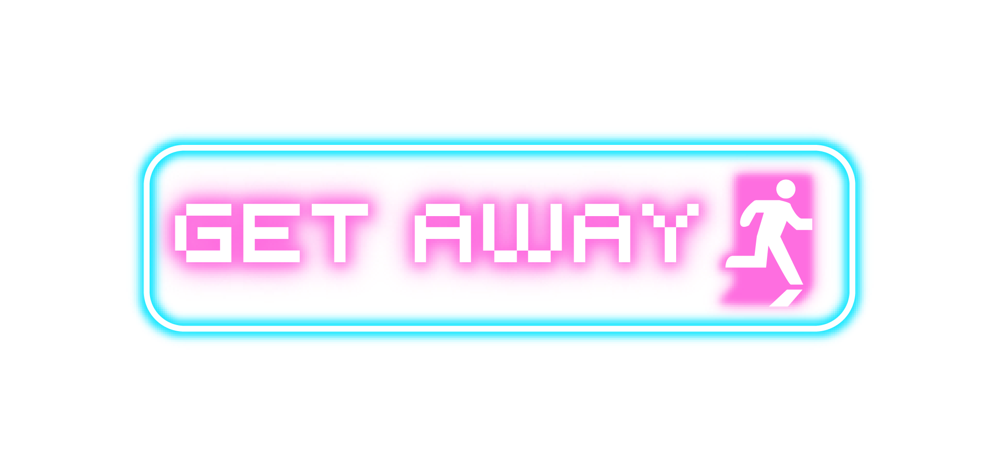

# GetAway

Projet tutoré de jeu vidéo en ligne. Il a été codé avec le framework **ReactJS** en langage **JavaScript**.

De l'intégration continue a aussi été mis en place à l'aide GitLab CI. Cela permet le deploiement automatique du jeu en ligne sur le server. [Lien internet vers le jeu](https://getaway.bastienbc.fr/)

## Composition du groupe

- Marina Daubigie
- Gaëlle Bouchenot
- Loïc Perret
- Romain Duprès
- Bastien Bombardella

